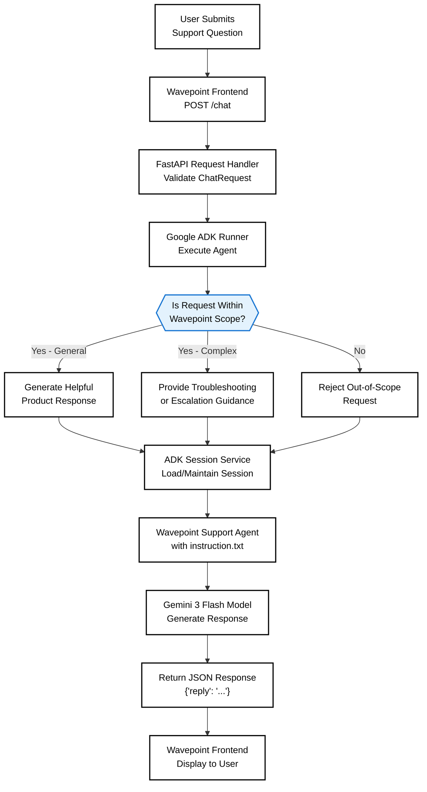

# Wavepoint Customer Support Microservice

An AI-powered customer support microservice for the **Wavepoint SaaS platform**, built with **Python, FastAPI, Google ADK, and Gemini**. This service provides intelligent support through a REST API, enabling the Wavepoint frontend and backend services to deliver real-time customer assistance.

---

## Overview

Wavepoint is a team workflow and project management SaaS platform. This microservice serves as the intelligent support layer, helping users understand, troubleshoot, and optimize their use of Wavepoint's features.

### Core Capabilities

- **Product Assistance** : Feature explanations and platform guidance
- **Intelligent Troubleshooting** : Step-by-step issue resolution with contextual awareness
- **Workflow Guidance** : Help with team coordination and task management
- **Smart Escalation** : Automatic escalation for complex or account-specific issues
- **Scope Management** : Controlled responses that stay within platform boundaries
- **Session Persistence** : In-memory session management for conversation continuity

---

## Architecture

The microservice follows a lightweight, scalable microservice pattern:



### Technology Stack

| Component | Technology |
|-----------|-----------|
| **Framework** | FastAPI |
| **AI Engine** | Google ADK (Agent Development Kit) |
| **LLM** | Gemini 3 Flash |
| **Language** | Python 3.9+ |
| **Session Management** | In-Memory Service |
| **API Protocol** | REST (JSON) |

---

## Project Structure

```
CustSupMicroService/
│
├── WPChatBot/                    # Core microservice package
│   ├── __init__.py               # Package initialization
│   ├── agent.py                  # ADK Agent configuration & logic
│   ├── api.py                    # FastAPI endpoints & request handlers
│   └── instruction.txt           # Support agent system instructions
│
├── main.py                       # Application entry point
├── requirements.txt              # Python dependencies
├── .gitignore                    # Git ignore rules
└── README.md                     # This file
```

---

## Getting Started

### Prerequisites

- Python 3.9 or higher
- Google Cloud credentials (for ADK & Gemini API access)
- pip package manager

### Installation

1. **Clone the repository**
   ```bash
   git clone <repository-url>
   cd CustSupMicroService
   ```

2. **Create a virtual environment**
   ```bash
   python -m venv venv
   source venv/bin/activate  # On Windows: venv\Scripts\activate
   ```

3. **Install dependencies**
   ```bash
   pip install -r requirements.txt
   ```

4. **Configure Google ADK credentials**
   ```bash
   export GOOGLE_APPLICATION_CREDENTIALS="path/to/credentials.json"
   ```

5. **Start the microservice**
   ```bash
   python main.py
   ```

The API will be available at `http://localhost:8000`
---

## Configuration

### Support Agent Instructions

The support agent's behavior is defined in `WPChatBot/instruction.txt`. This file contains:

- **Scope definitions** : What topics are within Wavepoint's domain
- **Response guidelines** : How to structure helpful answers
- **Escalation criteria** : When to escalate to the support team
- **Tone & style** : Communication preferences for the support agent

**Example instruction sections:**

```
# Wavepoint Support Agent Instructions

## Scope
You are a support agent for Wavepoint, a team workflow and project management platform.
You should help users with questions about:
- Creating and managing projects
- Task assignment and tracking
- Workspace collaboration
- Deadline management
- Team coordination

## Out of Scope
Do not provide assistance with:
- Unrelated software or tools
- General business advice outside Wavepoint
- Account billing or subscription changes
```

---

## Request Flow

1. **Request Validation** : FastAPI validates incoming ChatRequest
2. **Session Management** : ADK retrieves or creates user session
3. **Agent Execution** : Wavepoint Support Agent processes the message
4. **Gemini Processing** : LLM generates contextual response using instructions
5. **Response Return** : JSON response sent back to frontend

The agent intelligently:
- Classifies whether requests are within Wavepoint scope
- Routes simple questions for direct product guidance
- Identifies technical issues requiring troubleshooting
- Escalates complex or account-specific issues
- Maintains conversation context through sessions

---

## Development

### Running Locally

```bash
# Start the development server with auto-reload
python main.py --reload
```

### Running Tests

```bash
pytest tests/ -v
```

### Code Structure

**`api.py`** : FastAPI application and endpoint definitions
- Handles HTTP requests and validation
- Manages request/response formatting
- Coordinates with ADK runner

**`agent.py`** : ADK agent configuration
- Defines support agent behavior
- Integrates with Gemini model
- Manages instruction loading

**`instruction.txt`** : Agent system instructions
- Defines scope and capabilities
- Controls response behavior
- Sets escalation rules

---

## Monitoring & Logging

The service logs all requests and responses for monitoring:

```
INFO: User question received | user_id=user_123
INFO: Classifying request intent...
INFO: Response generated | type=product_guidance | duration=1.2s
```

Monitor these metrics:
- Request latency
- Response accuracy
- Escalation frequency
- Out-of-scope request rate
- Session reuse rate

---

## Security Considerations

- **Input Validation** : All requests are validated via Pydantic models
- **API Authentication** : Integrate authentication headers as needed
- **Scope Enforcement** : Agent respects defined scope boundaries
- **Data Privacy** : No sensitive data stored in sessions (use session IDs only)
- **Rate Limiting** : Implement rate limits for production deployments

------

## License

This project is licensed under the MIT License. see the [LICENSE](LICENSE) file for details.

-----

**Maintained by:** YERRAGUNTLA KAMESWARA SAI SRIKAR
**Last Updated:** September 03, 2026.